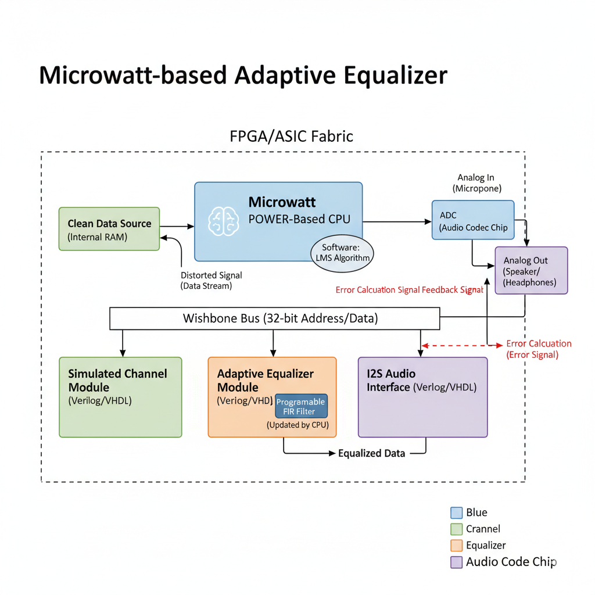

# Microwatt-based Adaptive Equalizer for Real-Time Channel Compensation

## 📝 Project Proposal

### 1. Abstract

This project proposes the design and implementation of a real-time adaptive channel equalizer on a Field-Programmable Gate Array (FPGA), with the goal of ultimately targeting an ASIC fabrication. The system will leverage the open-source **Microwatt POWER-based CPU** as a central control element. This project aims to demonstrate a fundamental solution to a key problem in digital communications: channel impairments such as **Inter-Symbol Interference (ISI)**. The solution will involve a hardware-accelerated **Least Mean Square (LMS)** algorithm to automatically and dynamically compensate for a simulated channel's effects, ensuring accurate data recovery. This project is a sophisticated demonstration of a hardware-software co-design approach that contributes a practical, functional system to the open hardware ecosystem.

***

### 2. Problem Statement

In any digital communication system, the signal transmitted is inevitably distorted by the physical channel. This distortion is caused by effects like multipath propagation and frequency-selective fading, which cause the signal to spread in time, leading to **Inter-Symbol Interference (ISI)**. Without compensation, this can significantly increase the bit error rate, making high-speed, reliable communication impossible. Implementing real-time solutions to this problem in hardware is a significant challenge and a key area of expertise in modern System-on-Chip (SoC) design.

***

### 3. Proposed Solution

The project will build a complete communication subsystem on a single chip, utilizing a sophisticated hardware-software co-design approach. The Microwatt core's architecture will be the foundation for this design. The Microwatt core is a **64-bit OpenPOWER (ppc64le) ISA** written in **VHDL 2008**.

#### 3.1. Hardware Architecture

The system will consist of three main custom hardware blocks integrated with the Microwatt CPU, all residing on a single FPGA. The overall system will fit within the structure of a Microwatt SoC.

* **Simulated Channel Module:** A custom Verilog/VHDL module will be designed to act as a realistic, yet controllable, communication channel. This module will intentionally apply known distortions (e.g., ISI) to a clean input signal, providing a predictable environment for debugging and testing the equalizer.
* **Adaptive Equalizer Module:** The core of the system will be an adaptive **Finite Impulse Response (FIR) filter** implemented as a dedicated hardware block. This filter's coefficients will be dynamically adjusted by the LMS algorithm to create an inverse model of the simulated channel. This dedicated hardware handles the computationally intensive multiplication and accumulation operations.
* **Audio Interface (I2S):** The system will use an I2S audio interface to output the equalized signal, allowing for a tangible, audible demonstration of the system's performance.

#### 3.2. Software and System Control

The **Microwatt CPU** will serve as the system's brain. It will manage data flow and execute the software that handles the LMS algorithm's core logic. The CPU's role includes:

* Loading the training sequence data into the system's memory.
* Managing communication between the custom hardware modules via the **Wishbone bus**.
* Executing the LMS algorithm, which calculates the error signal and updates the FIR filter coefficients.

***

### 4. Architecture Diagram

  

### 4. Licensing

This project is released under the **Apache License 2.0**. This is a permissive license that allows for the free use, modification, and distribution of the hardware and software for both commercial and non-commercial purposes. A full copy of the license is available in the `LICENSE` file in this repository.

---
